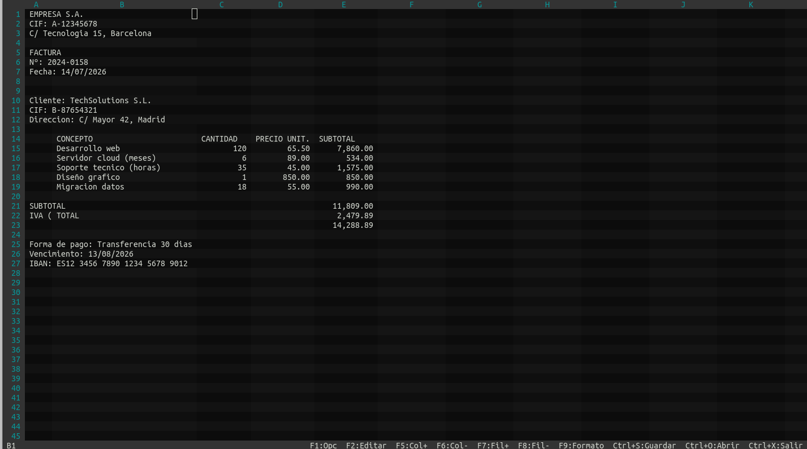
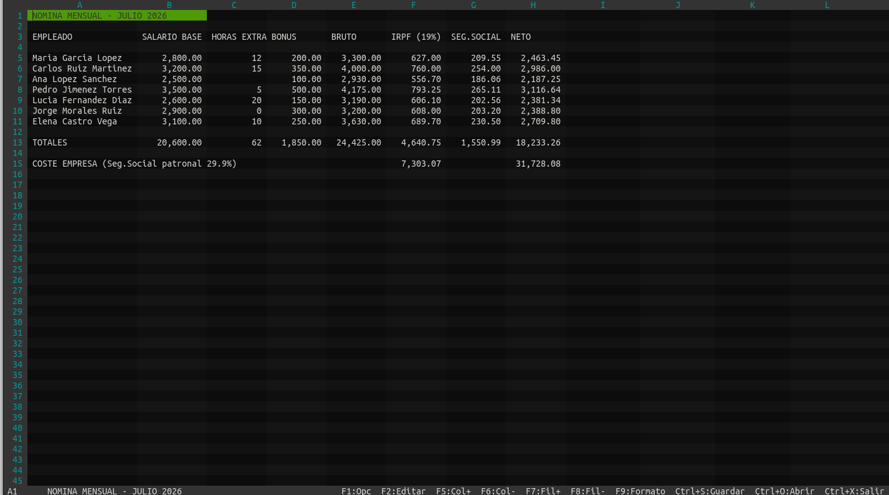
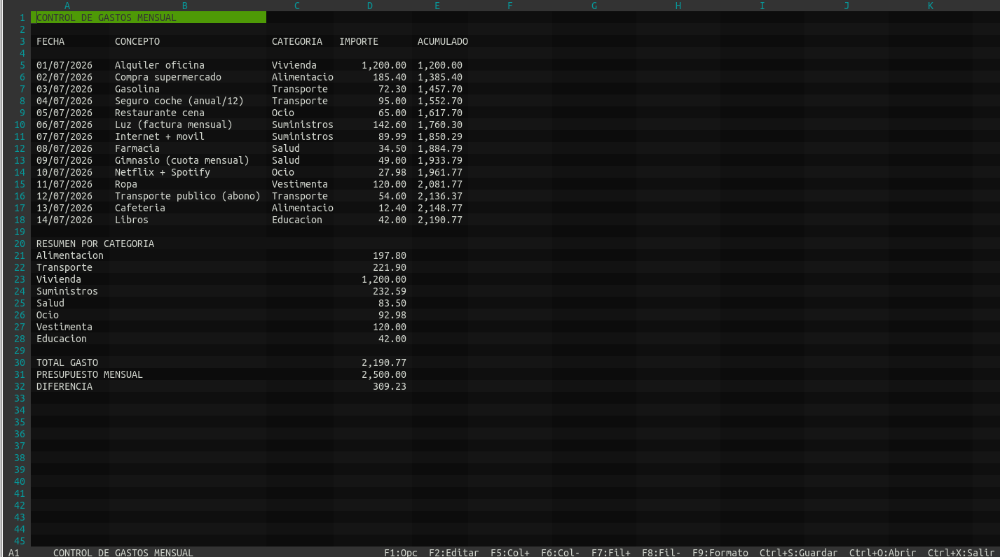
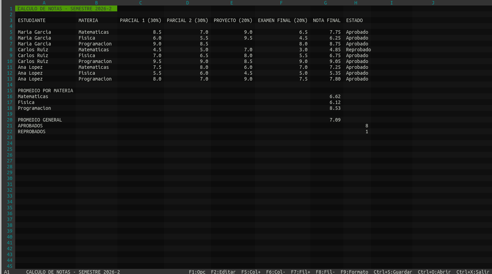
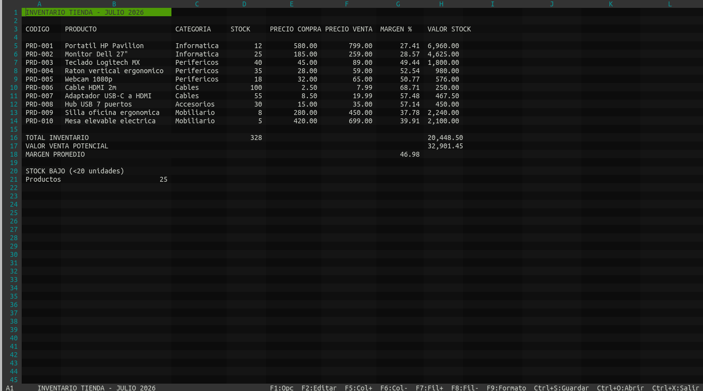
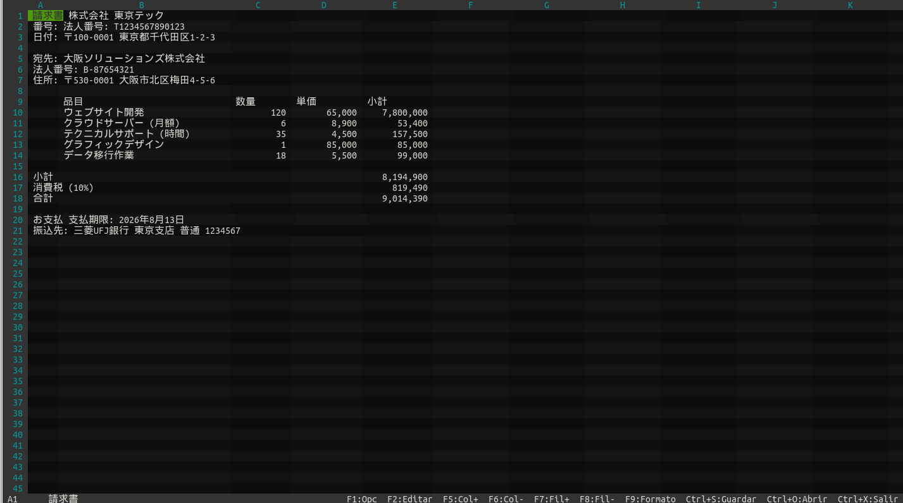
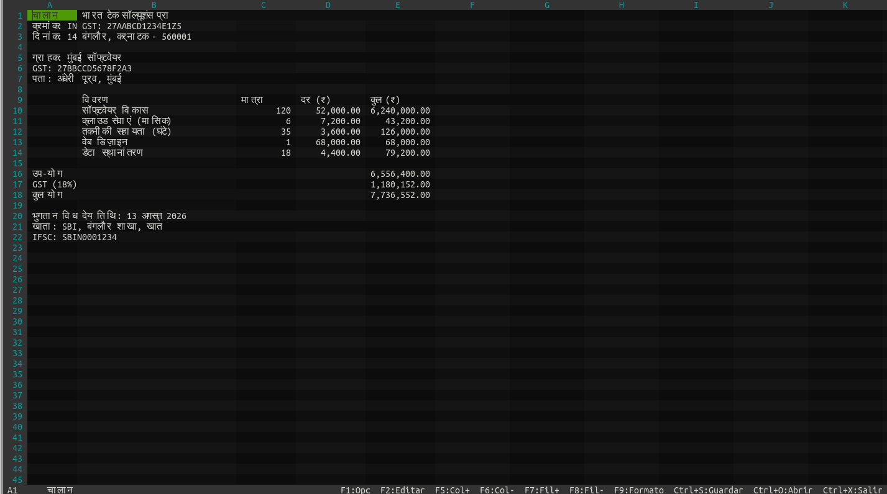

# Spreadsheet — Terminal Spreadsheet Application

A terminal-based spreadsheet application written in **C11** using **ncursesw**.
Formula evaluation, topological dependency recalculation, number formatting,
file persistence, themes, unicode support, and variable column widths —
all from your terminal.

## Screenshots

<p align="center">
  
  
  
  
  
  
  
</p>

## Quick Start

```bash
make
./spreadsheet                        # new sheet
./spreadsheet examples/01_factura_simple.ss   # open file
```

Requires **ncursesw** (wide-character variant) and a **UTF-8 locale**:

```bash
# Debian / Ubuntu
sudo apt install libncursesw5-dev

# Locale (must be UTF-8)
export LANG=C.UTF-8
```

## Features

- **Grid**: 26 columns (A–Z) × 100 rows, scrollable with fixed headers
- **Formulas**: arithmetic (`+`, `-`, `*`, `/`, `^`), parentheses, cell references (`A1`, `B5`)
- **Functions**: `SUMA(range)`, `PROMEDIO(range)` (Spanish: SUM, AVERAGE)
- **Topological recalculation**: dependency-based cascade propagation — only affected formulas recompute
- **Circular reference detection**: `#CIRC!` error via DFS
- **Number formatting**: per-cell or per-column format masks (`#,##0.00`, `0.00%`, etc.)
- **File I/O**: open/save `.ss` format (Ctrl+O / Ctrl+S)
- **Themes**: 6 color themes via F2, persisted to `~/.config/spreadsheet/`
- **Variable column widths**: adjustable per-column (4–40), saved in file
- **Default column width**: set with `DEFAULT_WIDTH` directive in `.ss` files
- **Checkerboard**: alternating cell shading (rows + columns)
- **Text overflow**: text spills into empty adjacent cells
- **Unicode**: full support (Latin-1, CJK, Arabic, Devanagari, emoji)
- **14 example files** in `examples/` (invoices, payroll, sales, etc.)
- **4 international invoices**: Japanese, Chinese, Arabic, Hindi

## Controls

### Navigation

| Key | Action |
|-----|--------|
| Arrow keys | Move between cells |
| Tab | Move right |
| Home / End | Jump to first / last column |
| Page Up / Down | Scroll by screen |

### Editing

| Key | Action |
|-----|--------|
| Enter / F2 | Start editing |
| Enter / Tab / ↓ / ↑ | Confirm and move |
| Esc | Cancel edit |
| Supr (Delete) | Clear cell content |
| Ctrl+→ / `+` | Increase column width (+1) |
| Ctrl+← / `-` | Decrease column width (−1) |

### File & System

| Key | Action |
|-----|--------|
| Ctrl+S | Save file (prompts if new) |
| Ctrl+O | Open file |
| Ctrl+X | Exit |
| F1 | Options menu (Help, Theme, Exit) |
| F2 | Enter edit mode |

## File Format (`.ss`)

```
# Spreadsheet v1
ROWS 100
COLS 26
DEFAULT_WIDTH 14
FORMAT B "#,##0.00"
FORMAT C3 "0.00%"
WIDTH A 10
WIDTH B 24
WIDTH D-Z 14
CELL A1 Invoice
CELL B1 Company Name
CELL A3 =B1
CELL B5 =A1*2
```

- `ROWS` / `COLS` — informational (app uses constants)
- `DEFAULT_WIDTH` — sets the initial width for all columns
- `FORMAT` — per-column (`FORMAT A "..."`) or per-cell (`FORMAT A1 "..."`) number format mask
- `WIDTH` — per-column width override (supports ranges: `D-Z 14`)
- `CELL` — cell content. Formulas start with `=`

## Formula Reference

| Syntax | Example | Description |
|--------|---------|-------------|
| `A1` | `=A1+B2` | Cell reference |
| `+ - * /` | `=10*3+5` | Arithmetic operators |
| `^` | `=2^10` | Exponentiation (right-assoc) |
| `(...)` | `=(A1+B1)*2` | Grouping |
| `SUMA(A1:A10)` | Range sum | Ignores text/empty cells |
| `PROMEDIO(B1:B5)` | Range average | Ignores text/empty cells |

### Format Masks

| Symbol | Meaning | Example | Input → Output |
|--------|---------|---------|-----------------|
| `0` | Digit placeholder (zero-padded) | `000` | `5` → `005` |
| `#` | Digit placeholder (no padding) | `#.##` | `3.1` → `3.1` |
| `.` | Decimal point | `#.00` | `5` → `5.00` |
| `,` | Thousands separator | `#,##0` | `1234` → `1,234` |
| `%` | Multiply by 100, append % | `0.00%` | `0.15` → `15.00%` |

Formats can be set per-column or per-cell via the `FORMAT` directive in `.ss` files. Cell-level format takes priority over column-level.

### Errors

| Code | Meaning |
|------|---------|
| `#CIRC!` | Circular reference |
| `#DIV0!` | Division by zero |
| `#REF!` | Invalid cell reference |
| `#ERR!` | General error |

## Themes

Press **F2** to cycle through themes:

| Theme | Style |
|-------|-------|
| Default | Blue selection on dark |
| Claro | White & light gray — spreadsheet style |
| HTOP Dark | Green/cyan — HTOP style |
| Amber | Retro amber terminal |
| Solarized | Solarized dark palette |
| Monochrome | Black & white |

Theme is persisted to `~/.config/spreadsheet/theme.conf`.

## Examples

```bash
./spreadsheet examples/01_factura_simple.ss        # Invoice (ES)
./spreadsheet examples/04_ventas_trimestrales.ss    # Quarterly sales
./spreadsheet examples/08_prestamo_hipotecario.ss   # Mortgage calculator
./spreadsheet examples/11_factura_japones.ss        # Japanese invoice
./spreadsheet examples/12_factura_chino.ss          # Chinese invoice
./spreadsheet examples/13_factura_arabe.ss          # Arabic invoice
./spreadsheet examples/14_factura_hindi.ss          # Hindi invoice
```

## Build

```bash
make          # Compile
make clean    # Remove object files

# Custom compiler:
make CC=clang
```

**Compiler flags**: `-std=c11 -Wall -Wextra -pedantic -O2`
**Linker flags**: `-lncursesw -lm`

## File Structure

```
spreadsheet/
├── Makefile
├── README.md
├── src/
│   ├── main.c          Entry point, ncurses init, main loop
│   ├── grid.h          Types, constants, function declarations
│   ├── grid.c          Grid data, cell storage, recalculation
│   ├── formula.c       Tokenizer, parser, evaluator
│   ├── dependency.c    Dependency tracking, cycle detection
│   ├── render.c        ncurses rendering, themes, overlays
│   ├── input.c         Keyboard handling, escape sequences
│   ├── edit.c          Cell editing
│   ├── config.c        Theme persistence (~/.config)
│   ├── fileio.c        File I/O (.ss format)
│   └── utf8.h          UTF-8 encoding helpers
└── examples/           14 spreadsheet files
```

## License

MIT
